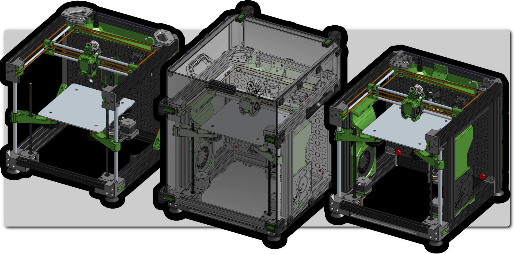

# E3NG v1.2
{: .text-center }
#### v1.2 = advanced version (customisable)
{: .text-center }

The v1.2 "advanced" is built for more experienced users who value modularity, higher configuration control, and overall flexibility. Unlike the standard version, v1.2 is not bound by kit constraints and instead offers a configurator-driven workflow that helps you setup the printer build based on your own preferences and gives you more customisation options.

Builders may choose to start with a different frame setup or incorporate upgrades such as LEDs, auxiliary cooling, stepper motor cooling, CNC-cut bed carriage, triple-Z motor configuration and others. These options are documented and categorized in the official configuration guide, allowing the end-user to balance cost, complexity, and performance according to their specific goals.

Due to the diversity of possible configurations, sourcing for the v1.2 requires manual part selection. To assist in this process, the configurator generates a tailored Bill of Materials with direct links to vetted sellers and clearly annotated specifications. This ensures that while the build is more demanding, it remains accessible to users with a clear roadmap.

The v1.2 advanced variant is best described as a platform for tinkering, experimentation, personalization, and performance tuning—offering high degree of flexibility in the E3NG family.

continue to:
{: .text-right .lh-0 .pt-8 }

[CONFIGURATION]{: .btn .fs-6 .fw-300 .text-yellow-300 }
{: .text-right }

[CONFIGURATION]: https://rh3d.xyz/
