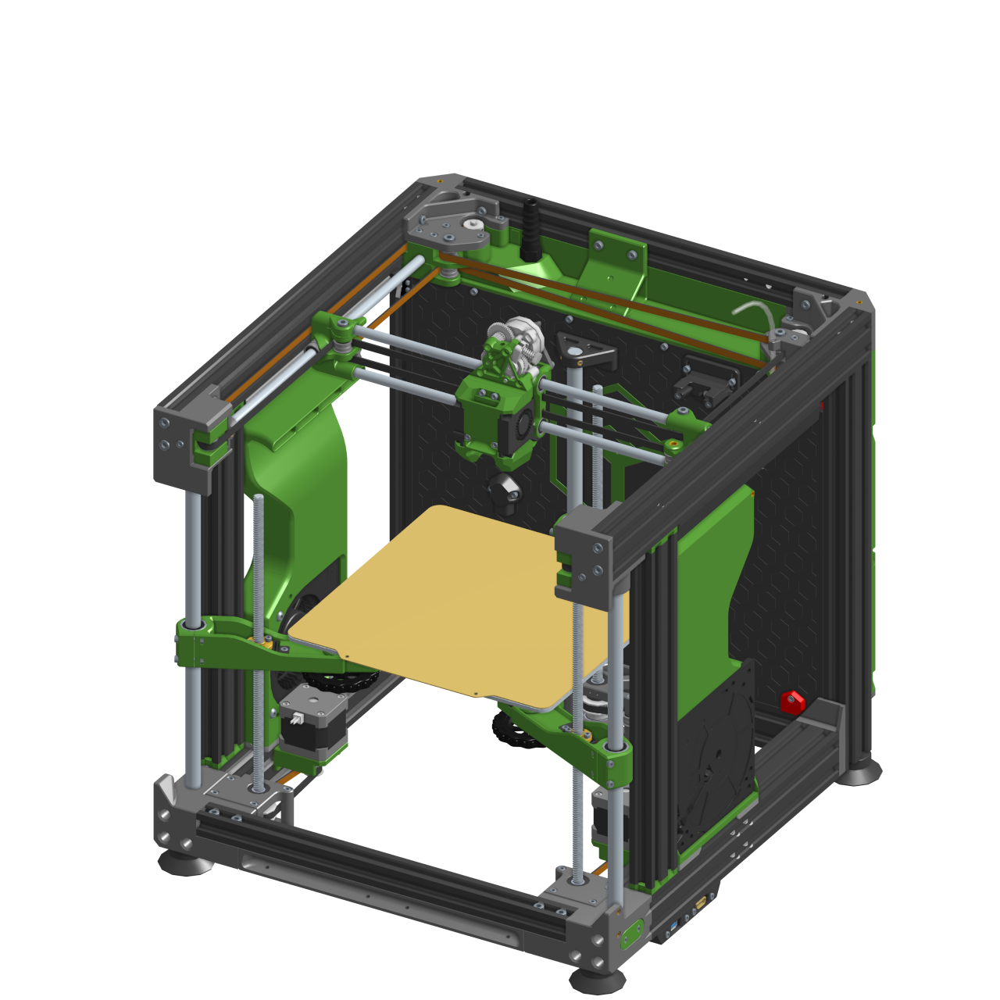
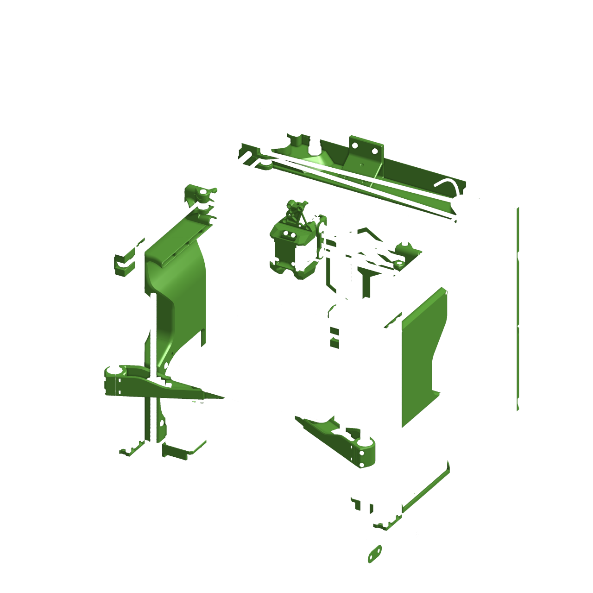
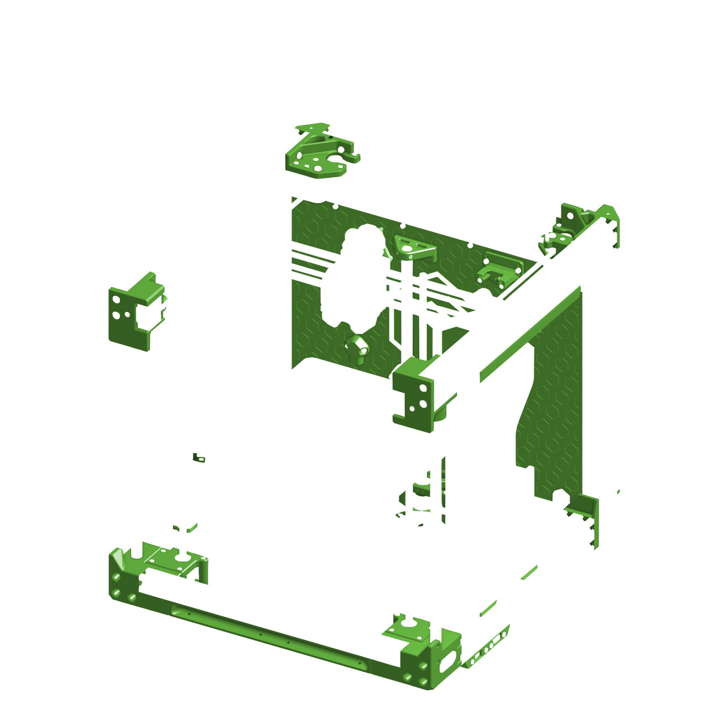

<html lang="cs">
<head>
    <meta charset="UTF-8">
    <meta name="viewport" content="width=device-width, initial-scale=1.0">
    <title>E3NG Color scheme helper</title>
    
</head>
<body>
    

        
        
        
        
    

    

        

            <h2>ACCENT COLOR</h2>
            

                <label for="brightness">BRI</label>
                <input type="number" id="brightness-number" class="number-input" min="0" max="100" value="50">
                <input type="range" id="brightness" class="slider" min="0" max="100" value="50">
            

            

                <label for="saturation">SAT</label>
                <input type="number" id="saturation-number" class="number-input" min="0" max="100" value="50">
                <input type="range" id="saturation" class="slider" min="0" max="100" value="50">
            

            

                <label for="hue">HUE</label>
                <input type="number" id="hue-number" class="number-input" min="0" max="100" value="0">
                <input type="range" id="hue" class="slider" min="0" max="100" value="0">
            

        

        

            <h2>MAIN COLOR</h2>
            

                <label for="brightness-2">BRI</label>
                <input type="number" id="brightness-number-2" class="number-input" min="0" max="100" value="20">
                <input type="range" id="brightness-2" class="slider" min="0" max="100" value="20">
            

            

                <label for="saturation-2">SAT</label>
                <input type="number" id="saturation-number-2" class="number-input" min="0" max="100" value="0">
                <input type="range" id="saturation-2" class="slider" min="0" max="100" value="0">
            

            

                <label for="hue-2">HUE</label>
                <input type="number" id="hue-number-2" class="number-input" min="0" max="100" value="0">
                <input type="range" id="hue-2" class="slider" min="0" max="100" value="0">
            

        

    

    
</body>
</html>
