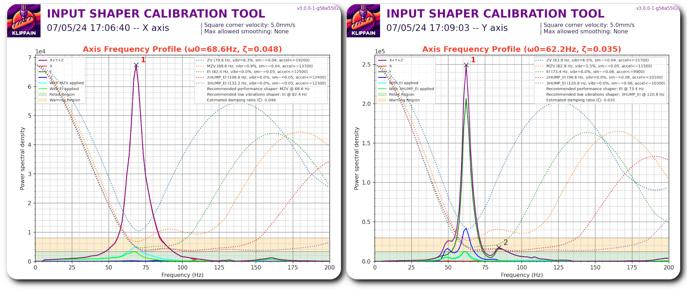

# FREQUENTLY ASKED QUESTIONS
{: .text-center }

### GENERAL

    
<h4 style="display:inline-block;margin-left:1.5em"> WHERE DO I START? WHERE DO I FIND ALL THE IMPORTANT INFORMATIONS, FILES AND DOCUMENTS? </h4>

The main crossroad for the project is this website, where you will find all the important information and links to build the printer. I would recommend reading through the entire website starting with <a href="https://rh3d.xyz/">E3NG</a> and <a href="https://rh3d.xyz/into.html">Into the project</a>. If you want to get even deeper and be part of the community, <a href="https://discord.com/invite/Zkvu6uu2AR">join the Discord</a>.

Main STL files ready to print are hosted on <a href="https://www.printables.com/en/model/922401">Printables</a>.

CAD files are currently available through a small donation on <a href="https://ko-fi.com/rh3dcz">Ko-Fi</a>.

    
<h4 style="display:inline-block;margin-left:1.5em"> WHERE IS THE BOM / BILL OF MATERIAL? </h4>

This project is using the <a href="https://rh3d.xyz/E3NG_v1_2/advanced/config">CONFIGURATOR</a>, which includes the BOM and other necessary things.

    
<h4 style="display:inline-block;margin-left:1.5em"> IS THERE A BUILD MANUAL/INSTRUCTIONS? </h4>

There is a build manual for the beta version, link is on the <a href="https://www.printables.com/en/model/922401">Printables</a> page.

Build manual for the E3 NG v1.2 is currently not existent but will be made.

    
<h4 style="display:inline-block;margin-left:1.5em"> IS THE PROJECT FREE? </h4>

The project is free for personal use and for use in a commercial environment (print farms, content making, presentational purposes) but it is not allowed to sell the project parts, files or assembly kits without a permission.

It is released under <a href="https://creativecommons.org/licenses/by-nc-sa/4.0/">CC BY-NC-SA 4.0 license</a>.

If you wish to sell kits or parts for the project, feel free to contact me through the <a href="https://rh3d.xyz/feedback.html">feedback</a>.

    
<h4 style="display:inline-block;margin-left:1.5em"> WHAT DOES THE FREE PART OF THE PROJECT INCLUDE? </h4>

STL files for printing all the parts, CONFIGURATOR with BILL OF MATERIAL and PRINTED PARTS.

In the future, the BUILD MANUAL will also be included.

    
<h4 style="display:inline-block;margin-left:1.5em"> CAN I GET THE CAD FILES? </h4>

Currently, CAD files are only available through a small donation on <a href="https://ko-fi.com/rh3dcz">Ko-Fi</a>.

    
<h4 style="display:inline-block;margin-left:1.5em"> HOW MUCH DOES THE CONVERSION COST? </h4>

This is highly dependent on the choices you make while configuring your printer. For the best idea, it is recommend to open the <a href="https://rh3d.xyz/E3NG_v1_2/advanced/config">CONFIGURATOR</a> and set your preferred setup, it will automatically calculate the estimated price.

 For the cheapest setup, the conversion price with BOM recommended parts can be around $ 240 (not incl. the filament price and the base printer).

    
<h4 style="display:inline-block;margin-left:1.5em"> HOW MUCH FILAMENT DO I NEED? </h4>

How much filament you need is highly dependent on your choices but the <a href="https://rh3d.xyz/E3NG_v1_2/advanced/config">CONFIGURATOR</a> will automatically calculate the necessary amount.

PS You can change the M (main) or A (accent) color in the BOM to modify your color setup and see the changes.

PPS It is always good to expect failed prints and have extra filament.

    
<h4 style="display:inline-block;margin-left:1.5em"> WHAT TYPE OF FILAMENT SHOULD I USE? </h4>

For filament recommendations and print instructions, look at <a href="https://rh3d.xyz/E3NG_v1_2/standard/printing_parts">PRINTING PARTS</a>.

    
<h4 style="display:inline-block;margin-left:1.5em"> WHY DOES THE PROJECT USE LINEAR RODS AND NOT LINEAR RAILS? </h4>

Linear rods were chosen as a cheaper and more accessible option. They are also very reliable, tested and proven to work very well.

Me and some community members (mainly Mr. Puffington - thanks!) have been testing the performance of linear rods and compared to linear rail setup (user mod based on Voron Trident gantry), version with linear rods has been superior allowing higher accelerations with clean input shaper results.

There might be some changes or more options in the future though.

    
<h4 style="display:inline-block;margin-left:1.5em"> WHAT FIRMWARE DOES THE PROJECT SUPPORT? </h4>

The project supports both Marlin and Klipper for selected boards, although the board compatibility will be getting wider.

Thanks to the use of DIN rails and the option to install universal cooling for the electronics, it is easy to install almost every board you can think of.

    
<h4 style="display:inline-block;margin-left:1.5em"> SHOULD I CHOOSE MARLIN OR KLIPPER? </h4>

I think both firmwares are very similar in the daily use capabilities, both support the latest and high end features. Marlin benefits from running on a single board with a display controller that makes it a simple and solid setup with no added costs while Klipper supports more detailed tuning and with the added SBC it has more power to print faster. It is also simpler to reconfigure your printer without need to reflash the firmware, although Marlin has a lot of variables that can be changed without reflashing the FW.

    
<h4 style="display:inline-block;margin-left:1.5em"> WILL I DESTROY MY ENDER 3? </h4>

No, this conversion will improve your Ender 3 in probably every way. If you decide to convert it just make sure and check at least twice that you have everything ready and that you understand what you are going to do. If you still decide that you liked your Ender 3 more than the Ender 3 NG, don't worry, the project is designed so that you don't make any changes to the original parts that would prevent you from rebuilding back to Ender 3.

### PERFORMANCE

    
<h4 style="display:inline-block;margin-left:1.5em"> WHAT SPEEDS AND ACCELERATIONS CAN I EXPECT FROM THIS BUILD? </h4>

This is hugely dependent on the quality and precision of your build, used parts and the final tuning you will perform. Usually well build and well tuned printers are capable of printing at around 300-400 mm/s and 10-15K mm/s2 with pretty good quality. That is about as fast as you can get with the stock creality stepper motors.

    
<h4 style="display:inline-block;margin-left:1.5em"> CAN I SEE THE INPUT SHAPER GRAPHS? </h4>

The IS result is a lot dependent on the build quality. Below I am posting some of my input shaper graphs.

    1. With printed frame verticals, no enclosure.

    2. With ultimate frame and enclosure (4mm panels + 5mm door).

  

### MECHANICAL

[Ender 3 NG]: https://rh3d.xyz/
[Into the project]: https://rh3d.xyz/into.html
[join the Discord]: https://discord.com/invite/Zkvu6uu2AR
[Printables]: https://www.printables.com/en/model/922401
[Ko-Fi]: https://ko-fi.com/rh3dcz
[CONFIGURATOR]: https://rh3d.xyz/E3NG_v1_2/advanced/config
[PRINTING PARTS]: https://rh3d.xyz/E3NG_v1_2/standard/printing_parts
